# XC-小草在线虚拟商城系统
> Python3.x | Flask | MySQL | BootStrap 4.6 | JQuery 3.6

## 快速运行

### 安装环境

```shell
python -m pip install -r requirements.txt 
```

### 修改配置

> 配置文件 config.py文件

```python
# todo MySQL配置 需要修改
MYSQLCONFIG = {
    "HOSTNAME": "数据库IP地址",
    "DATABASE": "使用的数据库",
    "PORT": 3306,
    "USERNAME": "数据库用户名",
    "PASSWORD": "数据库密码"
}

# todo 邮箱发送的密钥需要修改
# 邮箱账号 STMP密钥
MAIL_USERNAME = "邮箱账号"
MAIL_PASSWORD = "STMP密钥"
# 默认发件人
MAIL_DEFAULT_SENDER = "邮箱账号"

# todo 百度接口配置,需要官网申请
# https://ai.baidu.com/ai-doc/ANTIPORN/Jk3h6x8t2
# 百度接口配置
APP_ID = "APP_ID"
API_KEY = "API_KEY"
SECRET_KEY ="SECRET_KEY"
```

### 数据库迁移

> 完成上述配置后,使用数据迁移工具迁移

```shell
flask db init 
falsk db migrate 
flask db upgrade 
```

### 运行项目
> 运行app.py 访问 http://127.0.0.1:5000
```shell
 * Running on http://127.0.0.1:5000
```
## 项目截图
### 登录
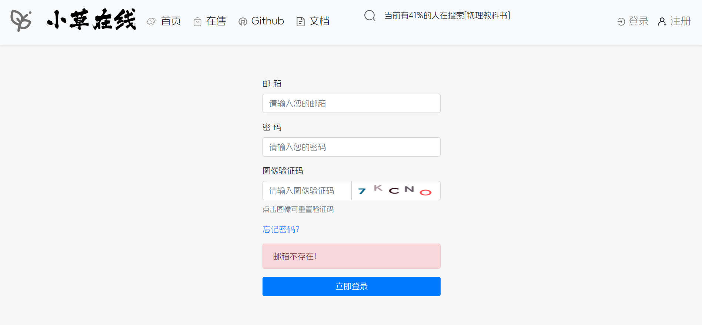
### 注册
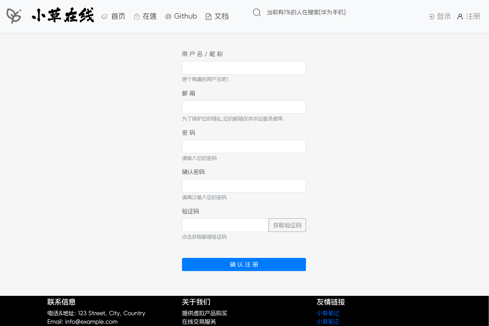
### 修改密码
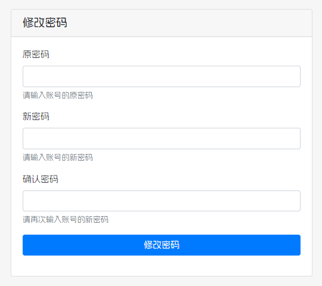
### 验证码注册
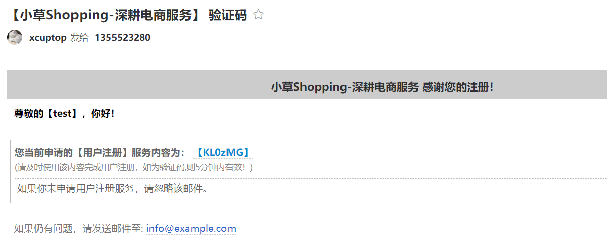
### 个人信息界面
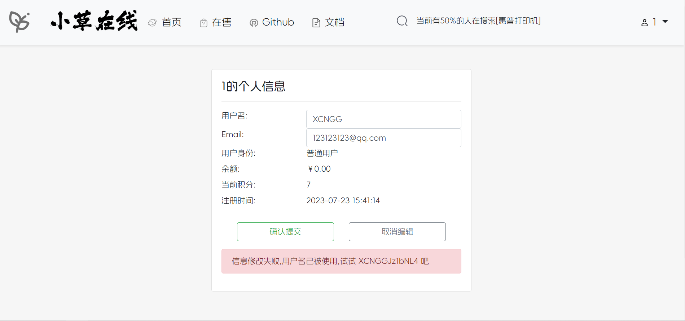
### 首页
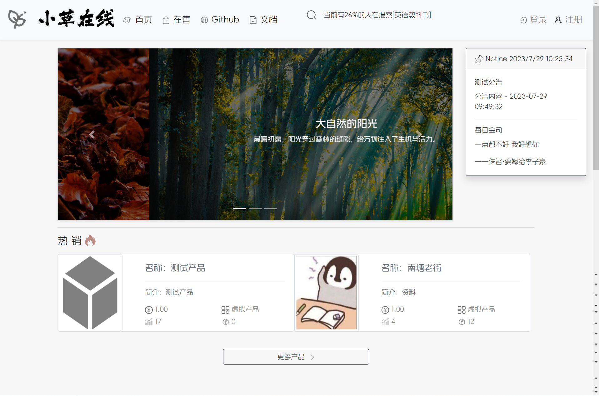
### 产品页面
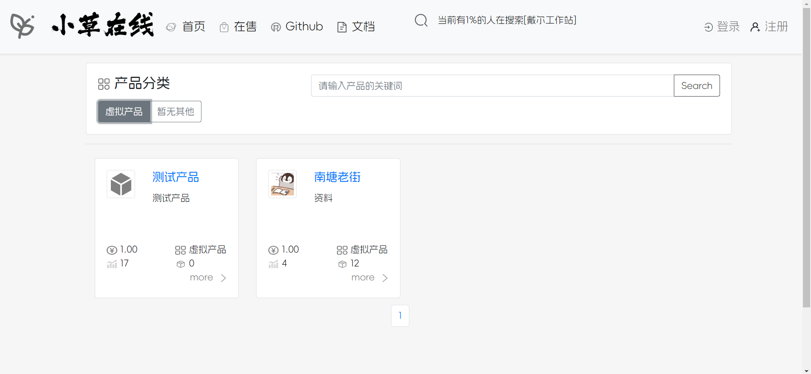
### 添加产品-图像审核
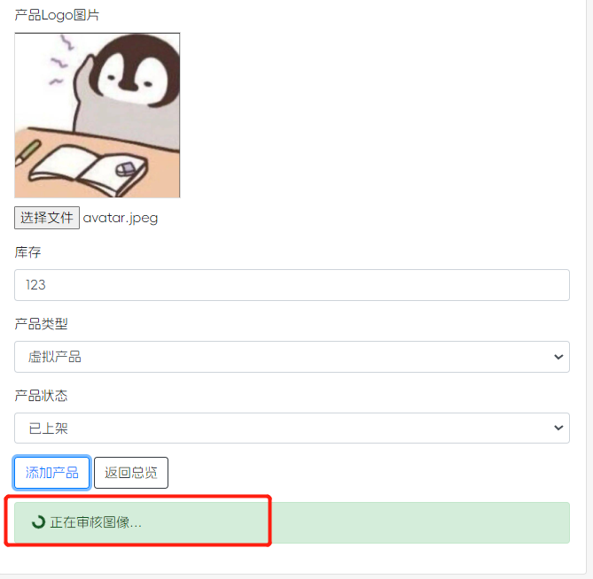
### 我的出售
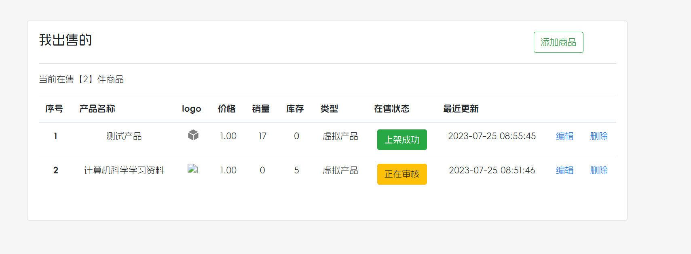
### 购买明细
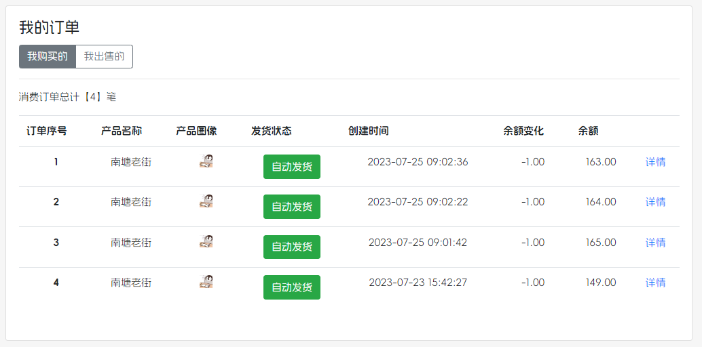
### 出售明细
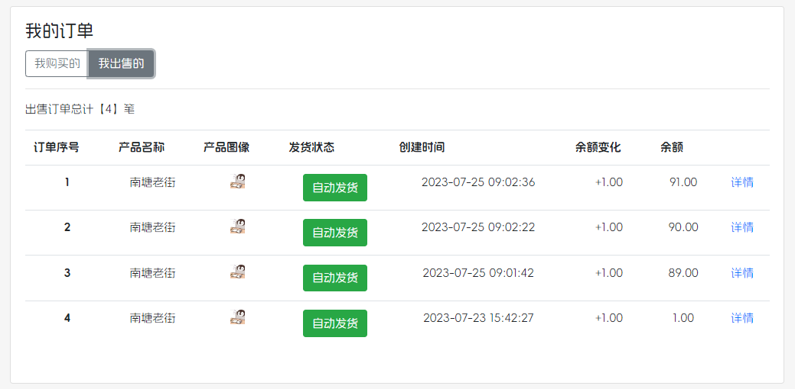